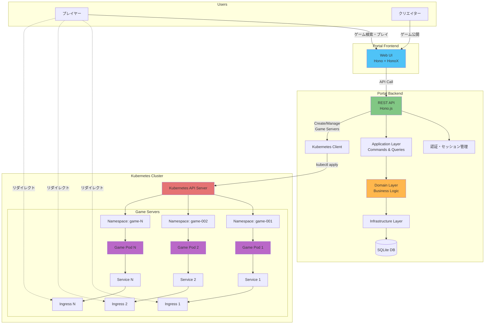
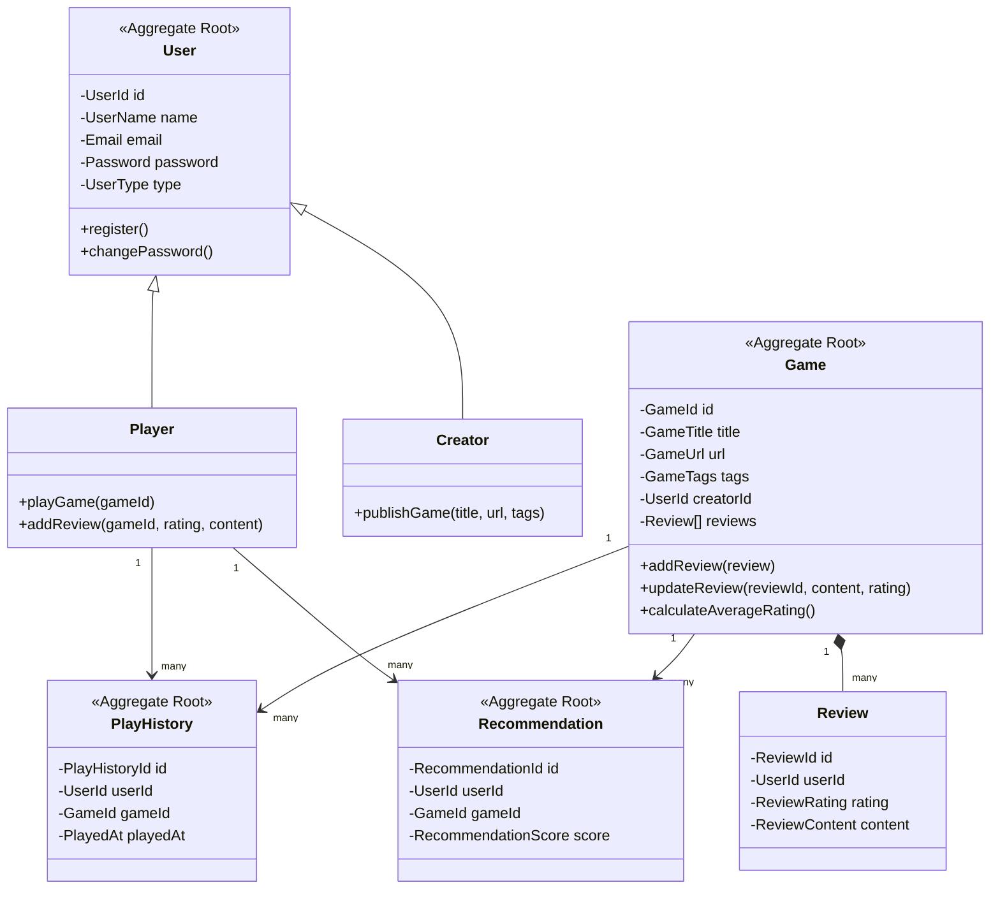
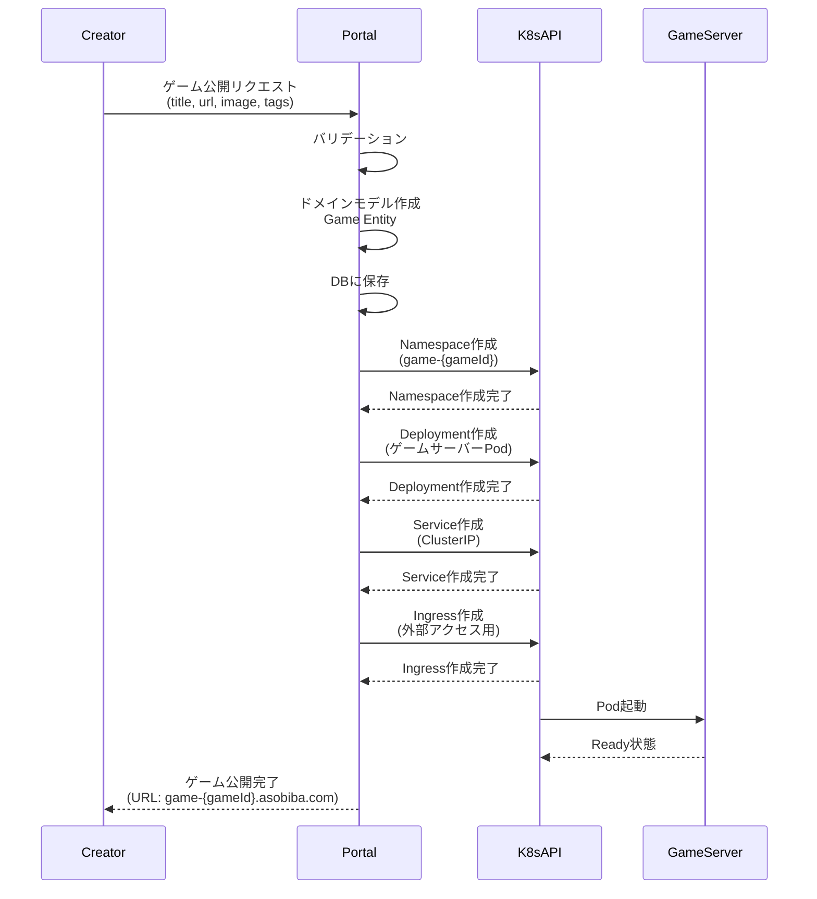
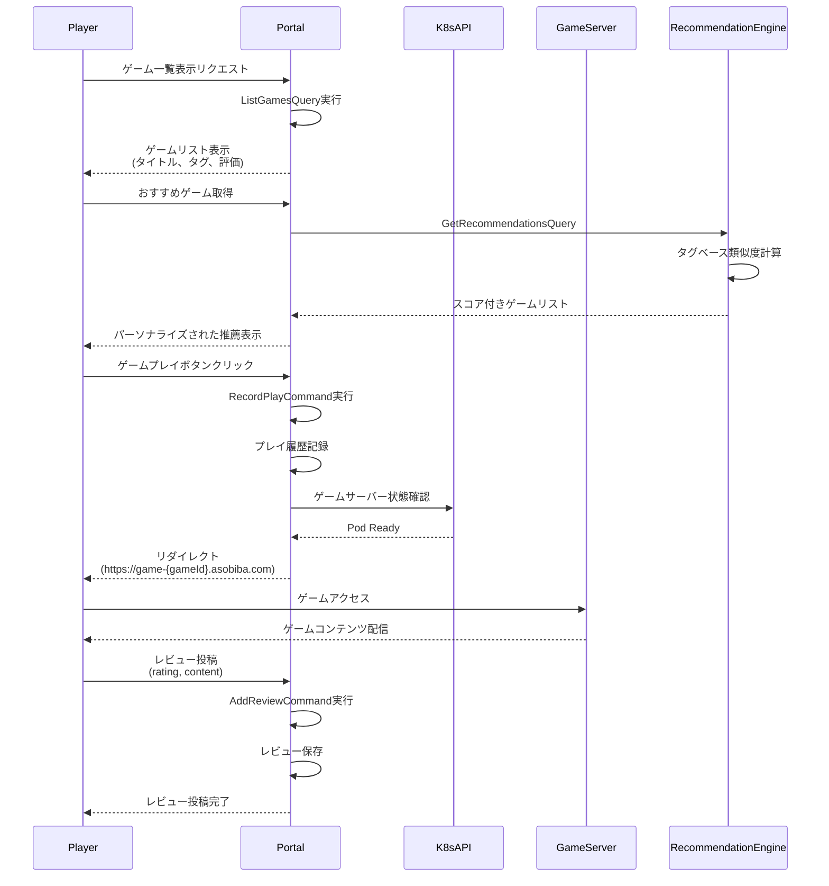

# Asobiba CMS

ゲームポータル＆コンテンツ管理システム - Kubernetes上で動的にゲームサーバーを作成し、ユーザーを各ゲームサーバーへルーティングするプラットフォーム

## 概要

Asobiba CMSは、ゲームクリエイターとプレイヤーをつなぐポータルサイトです。クリエイターがゲームを公開し、プレイヤーがゲームを発見・プレイ・レビューできるプラットフォームを提供します。

### 主な特徴

- **動的ゲームサーバー管理**: Kubernetes上で各ゲームに対して独立したサーバーを動的に作成
- **ユーザー管理**: プレイヤーとクリエイターの2つのロールをサポート
- **ゲーム公開**: クリエイターがゲームをメタデータ付きで公開
- **レビューシステム**: プレイヤーがゲームに評価とレビューを投稿
- **プレイ履歴トラッキング**: ユーザーのゲームプレイ履歴を記録
- **レコメンデーション**: タグベースの類似度計算による推薦エンジン
- **クリーンアーキテクチャ**: DDD原則に基づいた保守性の高い設計

## システムアーキテクチャ



## ドメインモデル



## ゲームサーバー作成フロー



## プレイヤーのゲームアクセスフロー



## 技術スタック

### Backend
- **Runtime**: Bun
- **Web Framework**: Hono.js (Edge-first, lightweight)
- **Database**: SQLite (better-sqlite3)
- **ORM**: Drizzle ORM + Drizzle Kit (migrations)
- **Authentication**: bcrypt + hono-sessions
- **Validation**: Zod

### Frontend
- **Framework**: HonoX (SSR support)
- **Styling**: Tailwind CSS
- **UI Components**: JSX-based reusable components

### Infrastructure
- **Container Orchestration**: Kubernetes
- **Deployment**: Cloudflare Workers (Portal) + K8s (Game Servers)
- **Build Tool**: Vite

### Testing
- **Framework**: Vitest
- **Strategy**: Unit tests for domain entities and value objects

## プロジェクト構成

```
/portal/
├── app/                          # Presentation Layer (Routes & UI)
│   ├── routes/                   # API & Web routes
│   │   ├── api/                  # REST API endpoints
│   │   │   ├── auth/            # 認証エンドポイント
│   │   │   ├── games/           # ゲーム管理API
│   │   │   ├── users/           # ユーザー管理API
│   │   │   ├── play-histories/  # プレイ履歴API
│   │   │   └── recommendations/ # 推薦API
│   │   └── games/               # ゲームページ (SSR)
│   ├── components/              # 再利用可能UIコンポーネント
│   └── islands/                 # インタラクティブコンポーネント
│
├── application/                 # Application Layer (Use Cases)
│   ├── auth/                    # 認証ユースケース
│   ├── game/                    # ゲーム管理ユースケース
│   ├── user/                    # ユーザー管理ユースケース
│   ├── play-history/            # プレイ履歴ユースケース
│   └── recommendation/          # 推薦ユースケース
│
├── domain/                      # Domain Layer (Business Logic)
│   ├── user/                    # ユーザー集約
│   │   ├── entities/           # User, Player, Creator
│   │   ├── value-objects/      # UserId, UserName, Email, Password
│   │   └── repositories/       # IUserRepository
│   ├── game/                    # ゲーム集約
│   │   ├── entities/           # Game, Review
│   │   ├── value-objects/      # GameId, GameTitle, GameUrl, ReviewRating
│   │   ├── repositories/       # IGameRepository
│   │   └── services/           # GamePublishService
│   ├── play-history/           # プレイ履歴集約
│   └── recommendation/         # 推薦集約
│
├── infrastructure/              # Infrastructure Layer
│   ├── persistence/            # データベース実装
│   │   ├── database.ts         # DB接続
│   │   ├── schema/             # Drizzleスキーマ
│   │   ├── repositories/       # リポジトリ実装
│   │   └── migrations/         # DBマイグレーション
│   ├── security/               # パスワードハッシング
│   └── batch/                  # バッチ処理 (推薦生成)
│
├── presentation/                # Presentation Helpers
│   ├── middleware/             # セッション、認証ミドルウェア
│   ├── validators/             # 入力バリデーション
│   └── mappers/                # DTO変換
│
├── k8s/                         # Kubernetes Manifests (予定)
│   ├── templates/              # ゲームサーバーテンプレート
│   └── configs/                # ConfigMap, Secret
│
└── tests/                       # テストスイート
```

## セットアップ

### 前提条件
- Bun 1.0+
- Node.js 18+
- Kubernetes Cluster (minikube, GKE, EKS, etc.)
- kubectl

### インストール

```bash
# リポジトリのクローン
git clone <repository-url>
cd asobiba_cms/portal

# 依存関係のインストール
bun install

# 環境変数の設定
cp .env.example .env
# .env を編集してDB_PATHとSESSION_SECRETを設定

# データベースのマイグレーション
bun run db:migrate

# 開発サーバーの起動
bun run dev
```

### Kubernetes設定 (今後実装予定)

```bash
# Kubernetes contextの設定
kubectl config use-context <your-cluster>

# Namespaceの作成
kubectl create namespace asobiba-games

# ポータルをK8sにデプロイ
kubectl apply -f k8s/portal/

# IngressController確認
kubectl get ingress -n asobiba-games
```

## API エンドポイント

### 認証
- `POST /api/auth/register` - ユーザー登録
- `POST /api/auth/login` - ログイン
- `POST /api/auth/logout` - ログアウト
- `GET /api/auth/me` - 現在のユーザー情報取得

### ゲーム
- `GET /api/games` - ゲーム一覧取得 (クエリ: `creatorId`, `tag`)
- `POST /api/games` - ゲーム公開 (Creator only)
- `GET /api/games/:id` - ゲーム詳細取得
- `POST /api/games/reviews` - レビュー投稿
- `PUT /api/games/:id/reviews` - レビュー更新

### プレイ履歴
- `GET /api/play-histories?userId=X` - プレイ履歴取得
- `GET /api/play-histories/check?userId=X&gameId=Y` - プレイ済みチェック
- `POST /api/play-histories` - プレイ記録

### 推薦
- `GET /api/recommendations?userId=X&limit=10` - おすすめゲーム取得

### ユーザー
- `GET /api/users` - ユーザー一覧
- `POST /api/users` - ユーザー作成

## スクリプト

```bash
# 開発
bun run dev              # 開発サーバー起動 (ホットリロード)

# ビルド
bun run build           # 本番ビルド

# データベース
bun run db:generate     # マイグレーションファイル生成
bun run db:migrate      # マイグレーション実行
bun run db:studio       # Drizzle Studio起動 (GUIでDB管理)

# バッチ処理
bun run batch:recommendations  # 推薦エンジン実行

# テスト
bun test                # テスト実行

# デプロイ
bun run deploy          # Cloudflare Workersにデプロイ

# コードフォーマット
bun run format          # Biomeでフォーマット
bun run lint            # Biomeでリント
```

## ライセンス

MIT

## コントリビューション

プルリクエストを歓迎します。大きな変更の場合は、まずissueを開いて変更内容を議論してください。
