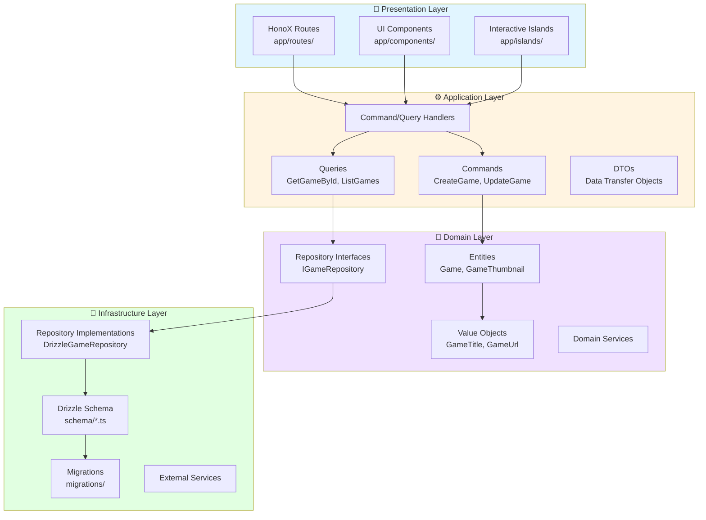
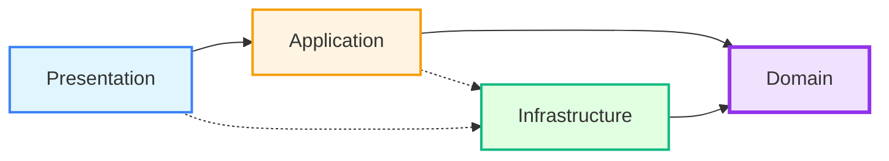
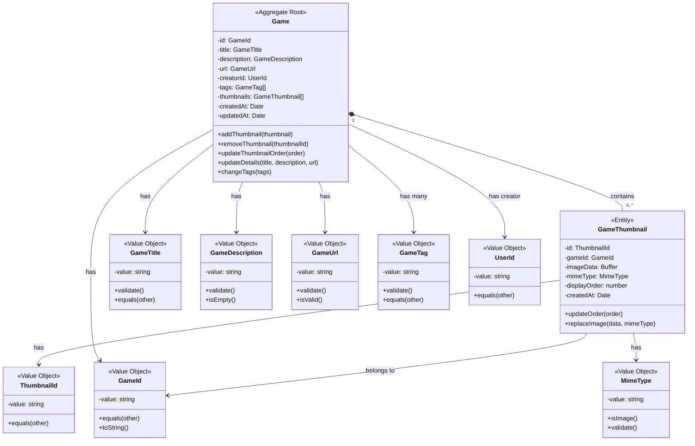
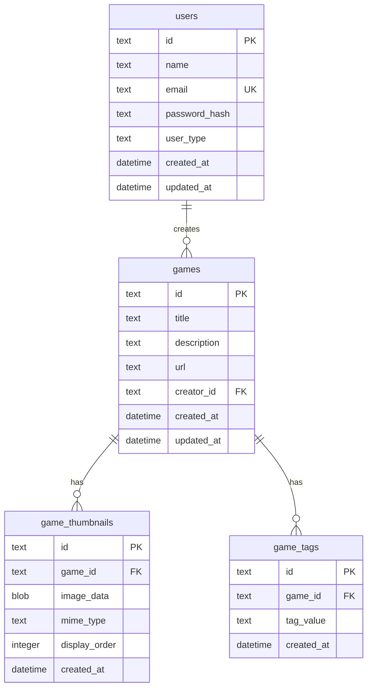
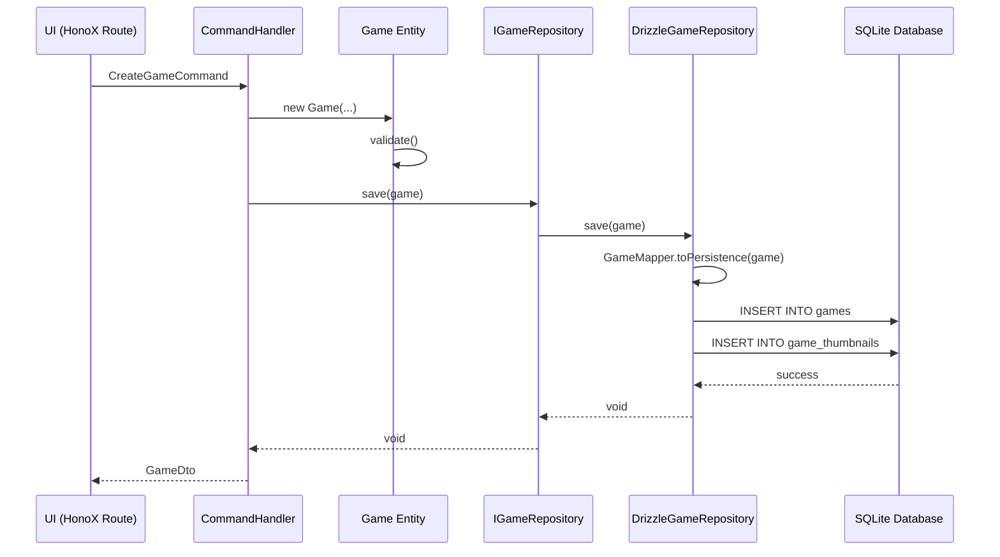

# ゲームポータルアプリケーション DDD設計書

## 目次
1. [概要](#概要)
2. [アーキテクチャ概要](#アーキテクチャ概要)
3. [ドメインモデル設計](#ドメインモデル設計)
4. [データベーススキーマ設計](#データベーススキーマ設計)
5. [レイヤー構造](#レイヤー構造)
6. [実装ガイドライン](#実装ガイドライン)

---

## 概要

本ドキュメントは、ゲームポータルアプリケーションのドメイン駆動設計（DDD）に基づく設計書です。

### アプリケーションの目的
- 複数のゲームへのリンクと説明を提供するポータルサイト
- [GetHomepage](https://gethomepage.dev/)をベースにしたUIコンセプト
- ゲームタイトル、説明、リンク、複数のサムネイル画像の管理

### 技術スタック
- **Runtime**: Bun
- **Web Framework**: Hono + HonoX (SSR)
- **ORM**: Drizzle ORM
- **Database**: SQLite
- **Frontend**: Tailwind CSS v4
- **Deployment**: Cloudflare Workers

---

## アーキテクチャ概要

### クリーンアーキテクチャレイヤー



### 依存関係の方向性



**原則**:
- すべてのレイヤーは**Domain層**に依存可能
- Domain層は他のレイヤーに依存しない（純粋なビジネスロジック）
- Infrastructure層はDomain層のインターフェースを実装
- Presentation層はApplication層を介してDomainにアクセス

---

## ドメインモデル設計

### ドメインモデル全体図



### 集約: Game

**Game集約**は、ゲームに関するすべての情報を管理する集約ルートです。

#### Gameエンティティ（集約ルート）

**責務**:
- ゲームの基本情報を保持
- サムネイル画像のコレクションを管理
- ビジネスルールの適用（例: 最大サムネイル数）

**属性**:
| 属性 | 型 | 説明 |
|------|-----|------|
| id | GameId | ゲームの一意識別子 |
| title | GameTitle | ゲームタイトル（1-200文字） |
| description | GameDescription | ゲーム説明（0-5000文字） |
| url | GameUrl | ゲームへのリンク（有効なURL） |
| creatorId | UserId | 作成者のユーザーID |
| tags | GameTag[] | ゲームタグのリスト |
| thumbnails | GameThumbnail[] | サムネイル画像のコレクション |
| createdAt | Date | 作成日時 |
| updatedAt | Date | 更新日時 |

**メソッド**:
```typescript
// サムネイル管理
addThumbnail(thumbnail: GameThumbnail): void
removeThumbnail(thumbnailId: ThumbnailId): void
updateThumbnailOrder(order: Map<ThumbnailId, number>): void

// ゲーム情報更新
updateDetails(title: GameTitle, description: GameDescription, url: GameUrl): void
changeTags(tags: GameTag[]): void

// 検証
canAddThumbnail(): boolean // 最大10個まで
```

#### GameThumbnailエンティティ

**責務**:
- サムネイル画像データを保持
- 表示順序を管理

**属性**:
| 属性 | 型 | 説明 |
|------|-----|------|
| id | ThumbnailId | サムネイルの一意識別子 |
| gameId | GameId | 所属するゲームのID |
| imageData | Buffer | 画像のバイナリデータ |
| mimeType | MimeType | 画像のMIMEタイプ |
| displayOrder | number | 表示順序（0から開始） |
| createdAt | Date | 作成日時 |

**メソッド**:
```typescript
updateOrder(order: number): void
replaceImage(data: Buffer, mimeType: MimeType): void
```

### 値オブジェクト

#### GameTitle
```typescript
class GameTitle {
  private readonly value: string;

  constructor(value: string) {
    if (!value || value.length < 1 || value.length > 200) {
      throw new Error('タイトルは1〜200文字である必要があります');
    }
    this.value = value.trim();
  }

  equals(other: GameTitle): boolean {
    return this.value === other.value;
  }

  toString(): string {
    return this.value;
  }
}
```

#### GameDescription
```typescript
class GameDescription {
  private readonly value: string;

  constructor(value: string) {
    if (value.length > 5000) {
      throw new Error('説明は5000文字以内である必要があります');
    }
    this.value = value.trim();
  }

  isEmpty(): boolean {
    return this.value.length === 0;
  }
}
```

#### GameUrl
```typescript
class GameUrl {
  private readonly value: string;

  constructor(value: string) {
    try {
      new URL(value);
      this.value = value;
    } catch {
      throw new Error('無効なURLです');
    }
  }

  isValid(): boolean {
    return this.value.startsWith('http://') ||
           this.value.startsWith('https://');
  }
}
```

#### MimeType
```typescript
class MimeType {
  private static readonly ALLOWED_TYPES = [
    'image/jpeg',
    'image/png',
    'image/webp',
    'image/gif'
  ];

  private readonly value: string;

  constructor(value: string) {
    if (!MimeType.ALLOWED_TYPES.includes(value)) {
      throw new Error(`サポートされていない画像形式です: ${value}`);
    }
    this.value = value;
  }

  isImage(): boolean {
    return this.value.startsWith('image/');
  }
}
```

### リポジトリインターフェース

```typescript
interface IGameRepository {
  // 基本的なCRUD
  findById(id: GameId): Promise<Game | null>;
  findAll(): Promise<Game[]>;
  save(game: Game): Promise<void>;
  delete(id: GameId): Promise<void>;

  // クエリメソッド
  findByCreatorId(creatorId: UserId): Promise<Game[]>;
  findByTag(tag: GameTag): Promise<Game[]>;
  findByTags(tags: GameTag[]): Promise<Game[]>;
  searchByTitle(keyword: string): Promise<Game[]>;

  // ページネーション
  findAllPaginated(page: number, pageSize: number): Promise<{
    games: Game[];
    total: number;
    hasMore: boolean;
  }>;

  // トランザクション
  exists(id: GameId): Promise<boolean>;
  count(): Promise<number>;
}
```

---

## データベーススキーマ設計

### ER図



### Drizzleスキーマ定義

#### games テーブル

```typescript
// infrastructure/persistence/drizzle/schema/games.ts
import { sqliteTable, text, integer } from 'drizzle-orm/sqlite-core';
import { sql } from 'drizzle-orm';

export const games = sqliteTable('games', {
  id: text('id').primaryKey(),
  title: text('title').notNull(),
  description: text('description').notNull().default(''),
  url: text('url').notNull(),
  creatorId: text('creator_id').notNull().references(() => users.id),
  createdAt: integer('created_at', { mode: 'timestamp' })
    .notNull()
    .default(sql`(unixepoch())`),
  updatedAt: integer('updated_at', { mode: 'timestamp' })
    .notNull()
    .default(sql`(unixepoch())`)
    .$onUpdate(() => new Date()),
});
```

#### game_thumbnails テーブル

```typescript
// infrastructure/persistence/drizzle/schema/gameThumbnails.ts
import { sqliteTable, text, blob, integer } from 'drizzle-orm/sqlite-core';
import { sql } from 'drizzle-orm';

export const gameThumbnails = sqliteTable('game_thumbnails', {
  id: text('id').primaryKey(),
  gameId: text('game_id')
    .notNull()
    .references(() => games.id, { onDelete: 'cascade' }),
  imageData: blob('image_data', { mode: 'buffer' }).notNull(),
  mimeType: text('mime_type').notNull(),
  displayOrder: integer('display_order').notNull().default(0),
  createdAt: integer('created_at', { mode: 'timestamp' })
    .notNull()
    .default(sql`(unixepoch())`),
});
```

#### game_tags テーブル

```typescript
// infrastructure/persistence/drizzle/schema/gameTags.ts
import { sqliteTable, text, integer } from 'drizzle-orm/sqlite-core';
import { sql } from 'drizzle-orm';

export const gameTags = sqliteTable('game_tags', {
  id: text('id').primaryKey(),
  gameId: text('game_id')
    .notNull()
    .references(() => games.id, { onDelete: 'cascade' }),
  tagValue: text('tag_value').notNull(),
  createdAt: integer('created_at', { mode: 'timestamp' })
    .notNull()
    .default(sql`(unixepoch())`),
});
```

### インデックス設計

```typescript
// パフォーマンス最適化のためのインデックス
import { index } from 'drizzle-orm/sqlite-core';

// games テーブル
export const gamesCreatorIdIdx = index('games_creator_id_idx').on(games.creatorId);
export const gamesTitleIdx = index('games_title_idx').on(games.title);

// game_thumbnails テーブル
export const gameThumbnailsGameIdIdx = index('game_thumbnails_game_id_idx')
  .on(gameThumbnails.gameId);
export const gameThumbnailsDisplayOrderIdx = index('game_thumbnails_display_order_idx')
  .on(gameThumbnails.gameId, gameThumbnails.displayOrder);

// game_tags テーブル
export const gameTagsGameIdIdx = index('game_tags_game_id_idx').on(gameTags.gameId);
export const gameTagsTagValueIdx = index('game_tags_tag_value_idx').on(gameTags.tagValue);
```

### データサイズ考慮事項

**サムネイル画像のストレージ**:
- **推奨最大サイズ**: 1MB/画像
- **最大サムネイル数**: 10個/ゲーム
- **合計最大サイズ**: 10MB/ゲーム

**SQLiteの制約**:
- BLOBフィールドの最大サイズ: 1GB（デフォルト）
- 実用的な推奨サイズ: 10MB以下/レコード

**代替案**: 画像をCloudflare R2/S3に保存し、URLのみをDBに保存
```typescript
// 代替スキーマ（URL参照方式）
export const gameThumbnails = sqliteTable('game_thumbnails', {
  id: text('id').primaryKey(),
  gameId: text('game_id').notNull().references(() => games.id),
  imageUrl: text('image_url').notNull(), // 外部ストレージのURL
  mimeType: text('mime_type').notNull(),
  displayOrder: integer('display_order').notNull(),
  createdAt: integer('created_at', { mode: 'timestamp' }).notNull(),
});
```

---

## レイヤー構造

### ディレクトリ構成

```
portal/
├── domain/                                    # ドメイン層
│   ├── game/
│   │   ├── entities/
│   │   │   ├── Game.ts                       # 集約ルート
│   │   │   └── GameThumbnail.ts              # エンティティ
│   │   ├── value-objects/
│   │   │   ├── GameId.ts
│   │   │   ├── GameTitle.ts
│   │   │   ├── GameDescription.ts
│   │   │   ├── GameUrl.ts
│   │   │   ├── GameTag.ts
│   │   │   ├── ThumbnailId.ts
│   │   │   └── MimeType.ts
│   │   ├── repositories/
│   │   │   └── IGameRepository.ts            # インターフェース
│   │   └── services/
│   │       └── GameDomainService.ts          # ドメインサービス
│   └── shared/
│       ├── Entity.ts                          # 基底エンティティ
│       └── ValueObject.ts                     # 基底値オブジェクト
│
├── application/                               # アプリケーション層
│   ├── game/
│   │   ├── commands/
│   │   │   ├── CreateGameCommand.ts
│   │   │   ├── CreateGameCommandHandler.ts
│   │   │   ├── UpdateGameCommand.ts
│   │   │   ├── UpdateGameCommandHandler.ts
│   │   │   ├── DeleteGameCommand.ts
│   │   │   ├── DeleteGameCommandHandler.ts
│   │   │   ├── AddThumbnailCommand.ts
│   │   │   ├── AddThumbnailCommandHandler.ts
│   │   │   ├── RemoveThumbnailCommand.ts
│   │   │   └── RemoveThumbnailCommandHandler.ts
│   │   ├── queries/
│   │   │   ├── GetGameByIdQuery.ts
│   │   │   ├── GetGameByIdQueryHandler.ts
│   │   │   ├── ListGamesQuery.ts
│   │   │   ├── ListGamesQueryHandler.ts
│   │   │   ├── SearchGamesQuery.ts
│   │   │   └── SearchGamesQueryHandler.ts
│   │   └── dtos/
│   │       ├── GameDto.ts
│   │       ├── GameThumbnailDto.ts
│   │       └── CreateGameDto.ts
│   └── shared/
│       ├── ICommand.ts
│       ├── ICommandHandler.ts
│       ├── IQuery.ts
│       └── IQueryHandler.ts
│
├── infrastructure/                            # インフラストラクチャ層
│   ├── persistence/
│   │   └── drizzle/
│   │       ├── schema/
│   │       │   ├── games.ts
│   │       │   ├── gameThumbnails.ts
│   │       │   ├── gameTags.ts
│   │       │   └── index.ts
│   │       ├── repositories/
│   │       │   ├── DrizzleGameRepository.ts
│   │       │   └── mappers/
│   │       │       ├── GameMapper.ts         # DB ⇔ Domain変換
│   │       │       └── GameThumbnailMapper.ts
│   │       ├── migrations/
│   │       │   └── [timestamp]_create_games.sql
│   │       └── connection.ts
│   └── external/
│       └── cloudflare/
│           └── R2ImageStorage.ts              # 画像ストレージ（オプション）
│
├── app/                                       # プレゼンテーション層
│   ├── routes/
│   │   ├── games/
│   │   │   ├── index.tsx                     # ゲーム一覧
│   │   │   ├── [id].tsx                      # ゲーム詳細
│   │   │   └── new.tsx                       # ゲーム作成
│   │   └── api/
│   │       └── games/
│   │           ├── index.ts                   # GET /api/games, POST /api/games
│   │           ├── [id].ts                    # GET/PUT/DELETE /api/games/:id
│   │           └── [id]/
│   │               └── thumbnails.ts          # POST /api/games/:id/thumbnails
│   ├── components/
│   │   ├── games/
│   │   │   ├── GameCard.tsx
│   │   │   ├── GameGrid.tsx
│   │   │   ├── GameDetail.tsx
│   │   │   └── ThumbnailGallery.tsx
│   │   └── ui/
│   ├── islands/
│   │   └── GameFormHandler.tsx
│   └── server.ts
│
└── tests/
    ├── unit/
    │   ├── domain/
    │   │   ├── game/
    │   │   │   ├── Game.test.ts
    │   │   │   └── GameThumbnail.test.ts
    │   │   └── value-objects/
    │   └── application/
    │       └── game/
    │           ├── CreateGameCommandHandler.test.ts
    │           └── GetGameByIdQueryHandler.test.ts
    └── integration/
        └── repositories/
            └── DrizzleGameRepository.test.ts
```

### データフロー



### レイヤー間の責務

#### 1. Domain層（ドメイン層）
**責務**:
- ビジネスルールの定義と適用
- エンティティと値オブジェクトの管理
- ドメインイベントの発行

**依存関係**: なし（完全に独立）

**例**:
```typescript
// domain/game/entities/Game.ts
export class Game {
  addThumbnail(thumbnail: GameThumbnail): void {
    if (this.thumbnails.length >= 10) {
      throw new Error('サムネイルは最大10個までです');
    }
    this.thumbnails.push(thumbnail);
  }
}
```

#### 2. Application層（アプリケーション層）
**責務**:
- ユースケースの実装
- トランザクション管理
- ドメインオブジェクトの調整
- DTOへの変換

**依存関係**: Domain層のみ

**例**:
```typescript
// application/game/commands/CreateGameCommandHandler.ts
export class CreateGameCommandHandler {
  constructor(private gameRepository: IGameRepository) {}

  async handle(command: CreateGameCommand): Promise<GameDto> {
    // 1. ドメインオブジェクトを生成
    const game = new Game(
      new GameId(uuid()),
      new GameTitle(command.title),
      new GameDescription(command.description),
      new GameUrl(command.url),
      new UserId(command.creatorId)
    );

    // 2. サムネイルを追加
    for (const thumb of command.thumbnails) {
      game.addThumbnail(new GameThumbnail(...));
    }

    // 3. リポジトリに保存
    await this.gameRepository.save(game);

    // 4. DTOに変換して返す
    return GameDto.fromDomain(game);
  }
}
```

#### 3. Infrastructure層（インフラストラクチャ層）
**責務**:
- データベースアクセスの実装
- 外部APIとの通信
- ドメインオブジェクト ⇔ データベースレコードの変換

**依存関係**: Domain層のインターフェースを実装

**例**:
```typescript
// infrastructure/persistence/drizzle/repositories/DrizzleGameRepository.ts
export class DrizzleGameRepository implements IGameRepository {
  async findById(id: GameId): Promise<Game | null> {
    // 1. DBから取得
    const row = await db
      .select()
      .from(games)
      .where(eq(games.id, id.toString()))
      .get();

    if (!row) return null;

    // 2. サムネイルも取得
    const thumbnails = await db
      .select()
      .from(gameThumbnails)
      .where(eq(gameThumbnails.gameId, id.toString()))
      .all();

    // 3. ドメインオブジェクトに変換
    return GameMapper.toDomain(row, thumbnails);
  }
}
```

#### 4. Presentation層（プレゼンテーション層）
**責務**:
- HTTPリクエスト/レスポンスの処理
- バリデーション（入力形式）
- UIの描画

**依存関係**: Application層とInfrastructure層

**例**:
```typescript
// app/routes/api/games/index.ts
import { zValidator } from '@hono/zod-validator';
import { CreateGameCommandHandler } from '@/application/game/commands';

app.post('/api/games', zValidator('json', createGameSchema), async (c) => {
  const body = c.req.valid('json');

  // コマンドハンドラーを呼び出し
  const handler = new CreateGameCommandHandler(gameRepository);
  const result = await handler.handle({
    title: body.title,
    description: body.description,
    url: body.url,
    creatorId: c.get('userId'),
    thumbnails: body.thumbnails,
  });

  return c.json(result, 201);
});
```

---

## 実装ガイドライン

### 命名規則

#### エンティティ
- **クラス名**: 単数形、PascalCase（例: `Game`, `GameThumbnail`）
- **ファイル名**: クラス名と同じ（例: `Game.ts`）

#### 値オブジェクト
- **クラス名**: 目的を明確に（例: `GameTitle`, `GameUrl`）
- **ファイル名**: クラス名と同じ（例: `GameTitle.ts`）

#### リポジトリ
- **インターフェース**: `I{Entity}Repository`（例: `IGameRepository`）
- **実装**: `Drizzle{Entity}Repository`（例: `DrizzleGameRepository`）

#### コマンド/クエリ
- **コマンド**: `{Verb}{Entity}Command`（例: `CreateGameCommand`）
- **ハンドラー**: `{Command}Handler`（例: `CreateGameCommandHandler`）
- **クエリ**: `{Verb}{Entity}Query`（例: `GetGameByIdQuery`）

#### DTO
- **クラス名**: `{Entity}Dto`（例: `GameDto`）
- **変換メソッド**: `fromDomain()`, `toDomain()`

### コーディング規約

#### エンティティの実装

```typescript
// domain/game/entities/Game.ts
import { Entity } from '@/domain/shared/Entity';
import type { GameId } from '../value-objects/GameId';
import type { GameThumbnail } from './GameThumbnail';

export class Game extends Entity<GameId> {
  private constructor(
    id: GameId,
    private _title: GameTitle,
    private _description: GameDescription,
    private _url: GameUrl,
    private _creatorId: UserId,
    private _thumbnails: GameThumbnail[] = [],
    private _tags: GameTag[] = [],
    private _createdAt: Date = new Date(),
    private _updatedAt: Date = new Date()
  ) {
    super(id);
  }

  // ファクトリーメソッド
  static create(
    title: GameTitle,
    description: GameDescription,
    url: GameUrl,
    creatorId: UserId
  ): Game {
    return new Game(
      new GameId(uuid()),
      title,
      description,
      url,
      creatorId
    );
  }

  // 再構築（リポジトリから復元時）
  static reconstitute(
    id: GameId,
    title: GameTitle,
    description: GameDescription,
    url: GameUrl,
    creatorId: UserId,
    thumbnails: GameThumbnail[],
    tags: GameTag[],
    createdAt: Date,
    updatedAt: Date
  ): Game {
    return new Game(
      id,
      title,
      description,
      url,
      creatorId,
      thumbnails,
      tags,
      createdAt,
      updatedAt
    );
  }

  // ゲッター（不変性を保つ）
  get title(): GameTitle {
    return this._title;
  }

  get thumbnails(): readonly GameThumbnail[] {
    return Object.freeze([...this._thumbnails]);
  }

  // ビジネスロジック
  addThumbnail(thumbnail: GameThumbnail): void {
    if (this._thumbnails.length >= 10) {
      throw new Error('サムネイルは最大10個までです');
    }
    this._thumbnails.push(thumbnail);
    this._updatedAt = new Date();
  }

  removeThumbnail(thumbnailId: ThumbnailId): void {
    const index = this._thumbnails.findIndex(t => t.id.equals(thumbnailId));
    if (index === -1) {
      throw new Error('サムネイルが見つかりません');
    }
    this._thumbnails.splice(index, 1);
    this._updatedAt = new Date();
  }

  updateDetails(
    title: GameTitle,
    description: GameDescription,
    url: GameUrl
  ): void {
    this._title = title;
    this._description = description;
    this._url = url;
    this._updatedAt = new Date();
  }
}
```

#### 値オブジェクトの実装

```typescript
// domain/game/value-objects/GameTitle.ts
import { ValueObject } from '@/domain/shared/ValueObject';

interface GameTitleProps {
  value: string;
}

export class GameTitle extends ValueObject<GameTitleProps> {
  private constructor(props: GameTitleProps) {
    super(props);
  }

  static create(value: string): GameTitle {
    // バリデーション
    if (!value || value.trim().length === 0) {
      throw new Error('タイトルは必須です');
    }

    const trimmed = value.trim();
    if (trimmed.length < 1 || trimmed.length > 200) {
      throw new Error('タイトルは1〜200文字である必要があります');
    }

    return new GameTitle({ value: trimmed });
  }

  get value(): string {
    return this.props.value;
  }

  toString(): string {
    return this.value;
  }
}
```

#### リポジトリの実装

```typescript
// infrastructure/persistence/drizzle/repositories/DrizzleGameRepository.ts
import { eq, like, inArray } from 'drizzle-orm';
import type { IGameRepository } from '@/domain/game/repositories/IGameRepository';
import type { Game } from '@/domain/game/entities/Game';
import { GameMapper } from './mappers/GameMapper';

export class DrizzleGameRepository implements IGameRepository {
  constructor(private db: DrizzleD1Database) {}

  async findById(id: GameId): Promise<Game | null> {
    const gameRow = await this.db
      .select()
      .from(games)
      .where(eq(games.id, id.toString()))
      .get();

    if (!gameRow) return null;

    const thumbnailRows = await this.db
      .select()
      .from(gameThumbnails)
      .where(eq(gameThumbnails.gameId, id.toString()))
      .orderBy(gameThumbnails.displayOrder)
      .all();

    const tagRows = await this.db
      .select()
      .from(gameTags)
      .where(eq(gameTags.gameId, id.toString()))
      .all();

    return GameMapper.toDomain(gameRow, thumbnailRows, tagRows);
  }

  async save(game: Game): Promise<void> {
    const persistence = GameMapper.toPersistence(game);

    await this.db.transaction(async (tx) => {
      // ゲーム本体の保存
      await tx
        .insert(games)
        .values(persistence.game)
        .onConflictDoUpdate({
          target: games.id,
          set: persistence.game,
        });

      // 既存のサムネイルを削除
      await tx
        .delete(gameThumbnails)
        .where(eq(gameThumbnails.gameId, persistence.game.id));

      // 新しいサムネイルを挿入
      if (persistence.thumbnails.length > 0) {
        await tx.insert(gameThumbnails).values(persistence.thumbnails);
      }

      // 既存のタグを削除
      await tx
        .delete(gameTags)
        .where(eq(gameTags.gameId, persistence.game.id));

      // 新しいタグを挿入
      if (persistence.tags.length > 0) {
        await tx.insert(gameTags).values(persistence.tags);
      }
    });
  }
}
```

#### マッパーの実装

```typescript
// infrastructure/persistence/drizzle/repositories/mappers/GameMapper.ts
export class GameMapper {
  static toDomain(
    gameRow: typeof games.$inferSelect,
    thumbnailRows: Array<typeof gameThumbnails.$inferSelect>,
    tagRows: Array<typeof gameTags.$inferSelect>
  ): Game {
    const thumbnails = thumbnailRows.map(row =>
      GameThumbnail.reconstitute(
        new ThumbnailId(row.id),
        new GameId(row.gameId),
        row.imageData,
        new MimeType(row.mimeType),
        row.displayOrder,
        row.createdAt
      )
    );

    const tags = tagRows.map(row => GameTag.create(row.tagValue));

    return Game.reconstitute(
      new GameId(gameRow.id),
      GameTitle.create(gameRow.title),
      GameDescription.create(gameRow.description),
      GameUrl.create(gameRow.url),
      new UserId(gameRow.creatorId),
      thumbnails,
      tags,
      gameRow.createdAt,
      gameRow.updatedAt
    );
  }

  static toPersistence(game: Game): {
    game: typeof games.$inferInsert;
    thumbnails: Array<typeof gameThumbnails.$inferInsert>;
    tags: Array<typeof gameTags.$inferInsert>;
  } {
    return {
      game: {
        id: game.id.toString(),
        title: game.title.toString(),
        description: game.description.toString(),
        url: game.url.toString(),
        creatorId: game.creatorId.toString(),
        createdAt: game.createdAt,
        updatedAt: game.updatedAt,
      },
      thumbnails: game.thumbnails.map((thumb, index) => ({
        id: thumb.id.toString(),
        gameId: game.id.toString(),
        imageData: thumb.imageData,
        mimeType: thumb.mimeType.toString(),
        displayOrder: index,
        createdAt: thumb.createdAt,
      })),
      tags: game.tags.map(tag => ({
        id: uuid(),
        gameId: game.id.toString(),
        tagValue: tag.toString(),
        createdAt: new Date(),
      })),
    };
  }
}
```

### テスト戦略

#### ドメイン層のテスト

```typescript
// tests/unit/domain/game/Game.test.ts
import { describe, it, expect } from 'vitest';
import { Game } from '@/domain/game/entities/Game';
import { GameTitle } from '@/domain/game/value-objects/GameTitle';

describe('Game Entity', () => {
  describe('addThumbnail', () => {
    it('should add a thumbnail successfully', () => {
      const game = Game.create(
        GameTitle.create('Test Game'),
        GameDescription.create('Description'),
        GameUrl.create('https://example.com'),
        new UserId('user-1')
      );

      const thumbnail = GameThumbnail.create(
        game.id,
        Buffer.from('data'),
        MimeType.create('image/png')
      );

      game.addThumbnail(thumbnail);

      expect(game.thumbnails).toHaveLength(1);
    });

    it('should throw error when adding more than 10 thumbnails', () => {
      const game = Game.create(
        GameTitle.create('Test Game'),
        GameDescription.create('Description'),
        GameUrl.create('https://example.com'),
        new UserId('user-1')
      );

      // 10個追加
      for (let i = 0; i < 10; i++) {
        game.addThumbnail(GameThumbnail.create(game.id, Buffer.from(''), MimeType.create('image/png')));
      }

      // 11個目でエラー
      expect(() => {
        game.addThumbnail(GameThumbnail.create(game.id, Buffer.from(''), MimeType.create('image/png')));
      }).toThrow('サムネイルは最大10個までです');
    });
  });
});
```

#### アプリケーション層のテスト

```typescript
// tests/unit/application/game/CreateGameCommandHandler.test.ts
import { describe, it, expect, vi } from 'vitest';
import { CreateGameCommandHandler } from '@/application/game/commands';
import type { IGameRepository } from '@/domain/game/repositories/IGameRepository';

describe('CreateGameCommandHandler', () => {
  it('should create a game successfully', async () => {
    // モックリポジトリ
    const mockRepository: IGameRepository = {
      save: vi.fn(),
      findById: vi.fn(),
      // ... その他のメソッド
    };

    const handler = new CreateGameCommandHandler(mockRepository);

    const command = {
      title: 'New Game',
      description: 'A great game',
      url: 'https://game.example.com',
      creatorId: 'user-1',
      thumbnails: [],
      tags: ['rpg', 'adventure'],
    };

    const result = await handler.handle(command);

    expect(result.title).toBe('New Game');
    expect(mockRepository.save).toHaveBeenCalledTimes(1);
  });
});
```

### マイグレーション管理

#### マイグレーション生成

```bash
# スキーマ変更後にマイグレーションを生成
npm run db:generate

# マイグレーションを実行
npm run db:migrate

# スキーマを確認
npm run db:studio
```

#### マイグレーションファイル例

```sql
-- infrastructure/persistence/drizzle/migrations/0001_create_games.sql
CREATE TABLE `games` (
  `id` text PRIMARY KEY NOT NULL,
  `title` text NOT NULL,
  `description` text NOT NULL DEFAULT '',
  `url` text NOT NULL,
  `creator_id` text NOT NULL,
  `created_at` integer NOT NULL DEFAULT (unixepoch()),
  `updated_at` integer NOT NULL DEFAULT (unixepoch()),
  FOREIGN KEY (`creator_id`) REFERENCES `users`(`id`)
);

CREATE TABLE `game_thumbnails` (
  `id` text PRIMARY KEY NOT NULL,
  `game_id` text NOT NULL,
  `image_data` blob NOT NULL,
  `mime_type` text NOT NULL,
  `display_order` integer NOT NULL DEFAULT 0,
  `created_at` integer NOT NULL DEFAULT (unixepoch()),
  FOREIGN KEY (`game_id`) REFERENCES `games`(`id`) ON DELETE CASCADE
);

CREATE TABLE `game_tags` (
  `id` text PRIMARY KEY NOT NULL,
  `game_id` text NOT NULL,
  `tag_value` text NOT NULL,
  `created_at` integer NOT NULL DEFAULT (unixepoch()),
  FOREIGN KEY (`game_id`) REFERENCES `games`(`id`) ON DELETE CASCADE
);

-- インデックス
CREATE INDEX `games_creator_id_idx` ON `games` (`creator_id`);
CREATE INDEX `games_title_idx` ON `games` (`title`);
CREATE INDEX `game_thumbnails_game_id_idx` ON `game_thumbnails` (`game_id`);
CREATE INDEX `game_thumbnails_display_order_idx` ON `game_thumbnails` (`game_id`, `display_order`);
CREATE INDEX `game_tags_game_id_idx` ON `game_tags` (`game_id`);
CREATE INDEX `game_tags_tag_value_idx` ON `game_tags` (`tag_value`);
```

### パフォーマンス最適化

#### N+1問題の回避

```typescript
// ❌ 悪い例: N+1クエリが発生
async findAll(): Promise<Game[]> {
  const gameRows = await db.select().from(games).all();

  const gamesWithThumbnails = [];
  for (const row of gameRows) {
    // 各ゲームごとにクエリ実行（N+1問題）
    const thumbnails = await db
      .select()
      .from(gameThumbnails)
      .where(eq(gameThumbnails.gameId, row.id))
      .all();

    gamesWithThumbnails.push({ ...row, thumbnails });
  }

  return gamesWithThumbnails;
}

// ✅ 良い例: 一括取得
async findAll(): Promise<Game[]> {
  // 1. すべてのゲームを取得
  const gameRows = await db.select().from(games).all();
  const gameIds = gameRows.map(g => g.id);

  // 2. すべてのサムネイルを一度に取得
  const thumbnailRows = await db
    .select()
    .from(gameThumbnails)
    .where(inArray(gameThumbnails.gameId, gameIds))
    .all();

  // 3. タグも一括取得
  const tagRows = await db
    .select()
    .from(gameTags)
    .where(inArray(gameTags.gameId, gameIds))
    .all();

  // 4. グルーピングしてマッピング
  const thumbnailsByGameId = thumbnailRows.reduce((acc, thumb) => {
    acc[thumb.gameId] = acc[thumb.gameId] || [];
    acc[thumb.gameId].push(thumb);
    return acc;
  }, {});

  const tagsByGameId = tagRows.reduce((acc, tag) => {
    acc[tag.gameId] = acc[tag.gameId] || [];
    acc[tag.gameId].push(tag);
    return acc;
  }, {});

  return gameRows.map(row =>
    GameMapper.toDomain(
      row,
      thumbnailsByGameId[row.id] || [],
      tagsByGameId[row.id] || []
    )
  );
}
```

### エラーハンドリング

#### ドメインエラー

```typescript
// domain/game/errors/GameErrors.ts
export class GameNotFoundError extends Error {
  constructor(gameId: string) {
    super(`ゲームが見つかりません: ${gameId}`);
    this.name = 'GameNotFoundError';
  }
}

export class ThumbnailLimitExceededError extends Error {
  constructor() {
    super('サムネイルは最大10個までです');
    this.name = 'ThumbnailLimitExceededError';
  }
}

export class InvalidGameUrlError extends Error {
  constructor(url: string) {
    super(`無効なゲームURLです: ${url}`);
    this.name = 'InvalidGameUrlError';
  }
}
```

#### APIエラーハンドリング

```typescript
// app/routes/api/games/[id].ts
app.get('/api/games/:id', async (c) => {
  try {
    const gameId = new GameId(c.req.param('id'));
    const query = new GetGameByIdQuery(gameId);
    const handler = new GetGameByIdQueryHandler(gameRepository);

    const result = await handler.handle(query);

    if (!result) {
      return c.json({ error: 'ゲームが見つかりません' }, 404);
    }

    return c.json(result);
  } catch (error) {
    if (error instanceof GameNotFoundError) {
      return c.json({ error: error.message }, 404);
    }

    console.error('Unexpected error:', error);
    return c.json({ error: '内部サーバーエラー' }, 500);
  }
});
```

---

## まとめ

### 主要な設計決定

1. **集約設計**: Gameを集約ルートとし、GameThumbnailを子エンティティとして管理
2. **画像ストレージ**: データベース内にBLOBとして保存（将来的にCloudflare R2への移行も可能）
3. **タグ管理**: 別テーブルで管理し、多対多の関係をサポート
4. **CQRS**: コマンドとクエリを分離し、読み取り/書き込みの最適化を可能に
5. **リポジトリパターン**: ドメイン層のインターフェースとインフラ層の実装を分離

### 実装の優先順位

#### Phase 1: 基盤構築
1. ドメインモデルの実装（エンティティ、値オブジェクト）
2. データベーススキーマの定義とマイグレーション
3. リポジトリの実装

#### Phase 2: ユースケース実装
1. ゲーム作成機能（CreateGameCommand）
2. ゲーム一覧取得（ListGamesQuery）
3. ゲーム詳細取得（GetGameByIdQuery）

#### Phase 3: 高度な機能
1. サムネイル管理（追加/削除/並び替え）
2. タグ検索
3. ページネーション

#### Phase 4: 最適化
1. キャッシング戦略
2. 画像の遅延ロード
3. パフォーマンスチューニング

### 参考リソース

- [Domain-Driven Design (Eric Evans)](https://www.domainlanguage.com/ddd/)
- [Drizzle ORM Documentation](https://orm.drizzle.team/)
- [Hono Documentation](https://hono.dev/)
- [Clean Architecture (Robert C. Martin)](https://blog.cleancoder.com/uncle-bob/2012/08/13/the-clean-architecture.html)
